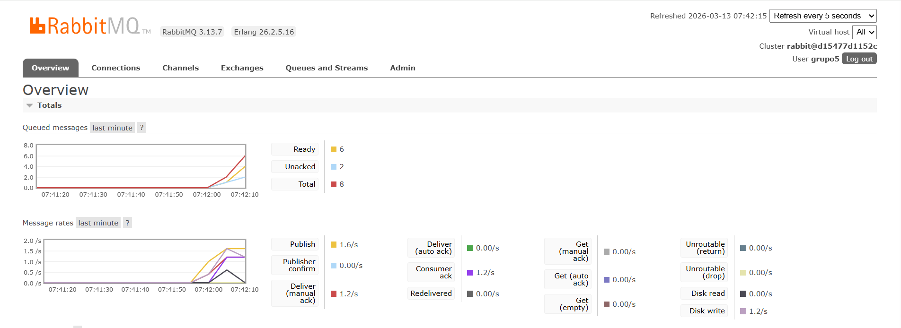
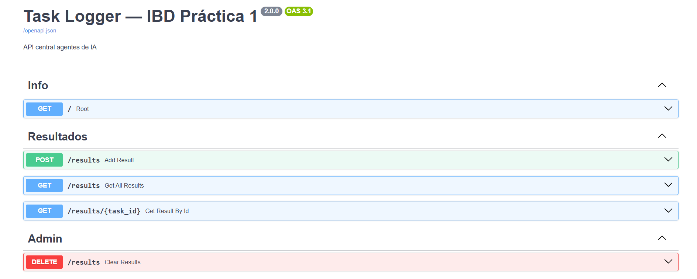
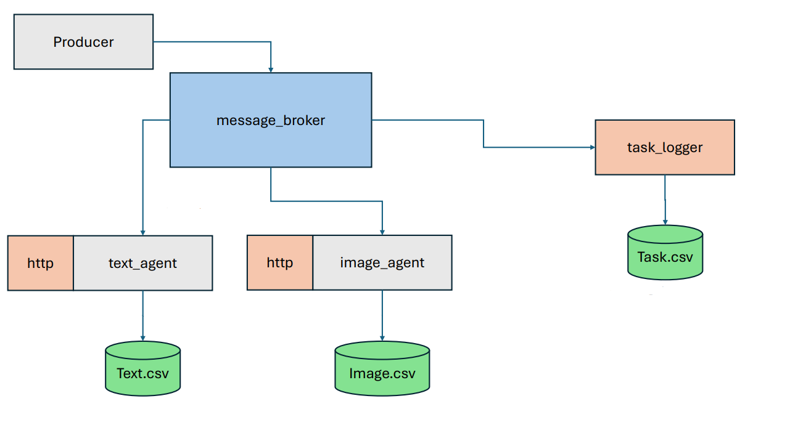

# Práctica 1 — Grupo 05
# Infraestructura de Procesamiento de Tareas con Agentes de IA

Básicamente construimos una "fábrica de tareas" distribuida: hay alguien generando trabajo sin parar, una cinta transportadora (RabbitMQ) que reparte ese trabajo, y agentes que lo procesan. Todo corre en contenedores Docker, todo persiste aunque caigas, y ahora además cada agente tiene su propia ventanilla donde puedes ir a pedirle cosas directamente.

---

## Cómo levantar todo

Necesitas Docker. Nada más.

```bash
git clone <URL_DEL_REPOSITORIO>
cd practica1
docker compose build && docker compose up
```

Eso levanta automáticamente:
- RabbitMQ (el cartero que reparte tareas)
- Task Producer (el que genera trabajo sin descanso)
- Text Agent (analiza sentimientos de texto)
- Image Agent (clasifica imágenes, agente bonus)
- Task Logger (el registro global de todo lo que pasa)

---

## Cómo ejecutar los agentes

Se levantan solos con el `docker compose up`. Pero si quieres más potencia, puedes escalar:

```bash
# 3 agentes de texto procesando en paralelo
docker compose up --scale text-agent=3
```

Cada instancia compite por las tareas de la cola. RabbitMQ se encarga de que ninguna tarea se procese dos veces.

---

## Cómo probar que funciona

### Ver el estado general

```bash
docker compose ps
```

### RabbitMQ — la cinta transportadora

Entra a `http://localhost:15672` con `grupo5` / `cbadenes` y ves en tiempo real cuántas tareas hay en cola y cuántos agentes están consumiendo.

### API síncrona de los agentes (nuevo en Día 2)

Cada agente tiene su propia API REST. Puedes mandarle tareas directamente sin pasar por RabbitMQ:

**Text Agent** (puerto 8001):
```bash
# Enviar una tarea
curl -X POST http://localhost:8001/tasks \
  -H "Content-Type: application/json" \
  -d '{"content": "This product is amazing!"}'

# Ver todas las tareas que conoce
curl http://localhost:8001/tasks

# Ver el resultado de una tarea concreta
curl http://localhost:8001/tasks/<task_id>
```

**Image Agent** (puerto 8002) — mismos endpoints:
```bash
curl -X POST http://localhost:8002/tasks \
  -H "Content-Type: application/json" \
  -d '{"content": "photo_cat.png"}'
```

### Global Task Logger (puerto 8000)

El logger central guarda todo en memoria y en disco (`tasks_log.csv`). Si reinicias el contenedor, los datos del CSV se recuperan solos.

```bash
# Ver todos los resultados
curl http://localhost:8000/results

# Ver resultado de una tarea específica
curl http://localhost:8000/results/<task_id>

# Estadísticas globales del sistema
curl http://localhost:8000/stats
```

O entra directo al navegador: `http://localhost:8000/docs` — FastAPI genera una UI interactiva.


### Ver el CSV persistido en disco

```bash
docker exec task-logger cat /data/tasks_log.csv
```

### Ver logs de cada servicio

```bash
docker compose logs task-producer
docker compose logs text-agent
docker compose logs image-agent
```

---

## Arquitectura



El flujo asíncrono (el original):
1. El Producer genera 1 tarea/segundo y la manda a RabbitMQ
2. RabbitMQ la pone en la cola correcta (`text_tasks` o `image_tasks`)
3. El agente disponible la toma, la procesa (3-5 segundos simulados)
4. Guarda el resultado en su CSV propio y notifica al Task Logger
5. Hace ACK a RabbitMQ → tarea confirmada, no se pierde

El flujo síncrono (nuevo en Día 2):
1. Alguien hace `POST /tasks` directo al agente
2. El agente acepta (202) y procesa en un hilo aparte
3. Puedes consultar el estado con `GET /tasks/<id>`
4. El resultado también llega al Task Logger

Ambos flujos conviven en el mismo contenedor usando **threads**.

---

## Decisiones de diseño

**¿Por qué RabbitMQ?**
Porque necesitamos que las tareas no se pierdan aunque los agentes estén ocupados. RabbitMQ actúa como buffer: el producer manda sin importar si hay alguien escuchando, y los agentes consumen a su ritmo. Colas `durable=True` + mensajes persistentes (`delivery_mode=2`) = nada se pierde ni si se cae el broker.

**¿Por qué ACK manual?**
Los agentes solo confirman la tarea *después* de guardar el resultado. Si algo falla antes del ACK, RabbitMQ la reencola. Orden: guardar CSV → notificar logger → ACK.

**¿Por qué Flask en los agentes?**
El enunciado pide que cada agente pueda recibir peticiones síncronas. Flask corre en el hilo principal, el consumidor de RabbitMQ en un hilo aparte. Mismo contenedor, dos cosas a la vez.

**¿Por qué FastAPI en el logger?**
Ya estaba montado del Día 1 y viene con documentación automática en `/docs`. Para el logger tiene más sentido que Flask porque maneja múltiples endpoints con validación de datos.

**Escalabilidad:**
Como los agentes no tienen `container_name` fijo, es posible lanzar múltiples instancias de cada tipo de agente utilizando la opción `--scale` de Docker Compose. Esto permite aumentar la capacidad de procesamiento del sistema simplemente agregando más consumidores a las colas de RabbitMQ.

RabbitMQ distribuye las tareas entre los agentes disponibles mediante el patrón de **competing consumers**, y gracias a la configuración `prefetch_count=1` reparte las tareas de forma equitativa entre las instancias activas.

La configuración idónea para obtener un **escalado equilibrado del sistema** es ejecutar **6 consumidores en total**, distribuidos de la siguiente manera:

- **3 agentes de texto**
- **3 agentes de imágenes**

Esto permite que ambos tipos de tareas se procesen en paralelo sin generar cuellos de botella en un solo tipo de agente.

La forma recomendada de levantar esta configuración es:

```bash
docker compose up --scale text-agent=3 --scale image-agent=3
```

Con esta configuración se mantiene un flujo estable entre el Task Producer, RabbitMQ y los agentes consumidores, permitiendo procesar múltiples tareas simultáneamente y manteniendo balanceado el sistema.

---

## Estructura del repositorio

```
practica1/
├── docker-compose.yml
├── README.md
├── producer/
│   ├── Dockerfile
│   ├── producer.py
│   └── requirements.txt
├── text_agent/
│   ├── Dockerfile
│   ├── text_agent.py
│   └── requirements.txt
├── image_agent/
│   ├── Dockerfile
│   ├── image_agent.py
│   └── requirements.txt
└── task_logger/
    ├── Dockerfile
    ├── main.py
    └── requirements.txt
```

---

## Puertos expuestos

| Servicio | Puerto | Qué es |
|----------|--------|--------|
| RabbitMQ UI | 15672 | Dashboard de colas |
| RabbitMQ AMQP | 5672 | Conexión interna de agentes |
| Task Logger | 8000 | API global + `/docs` |
| Text Agent | 8001 | API síncrona del agente |
| Image Agent | 8002 | API síncrona del agente |
